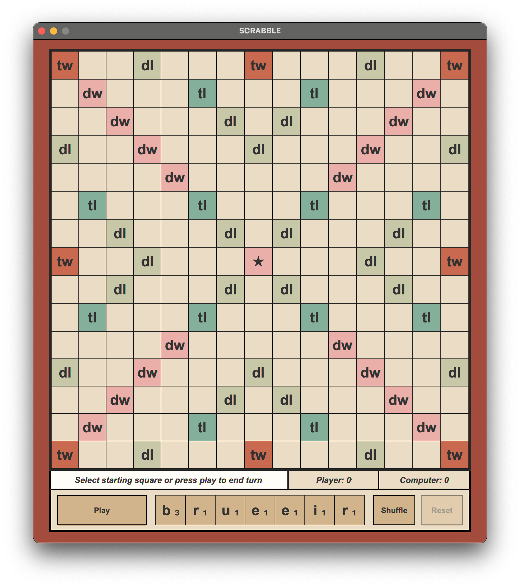
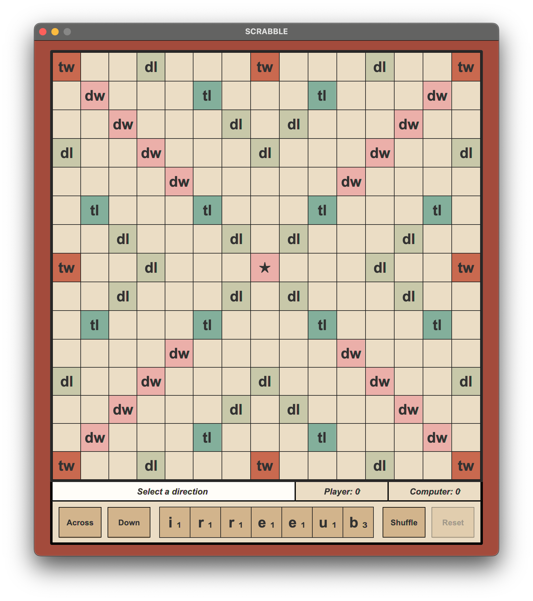
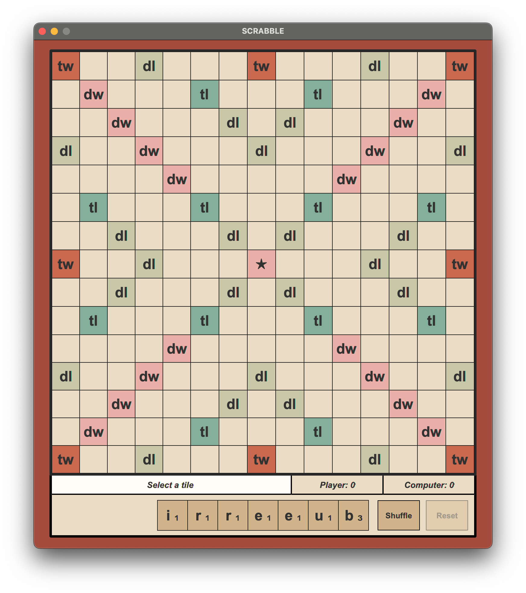
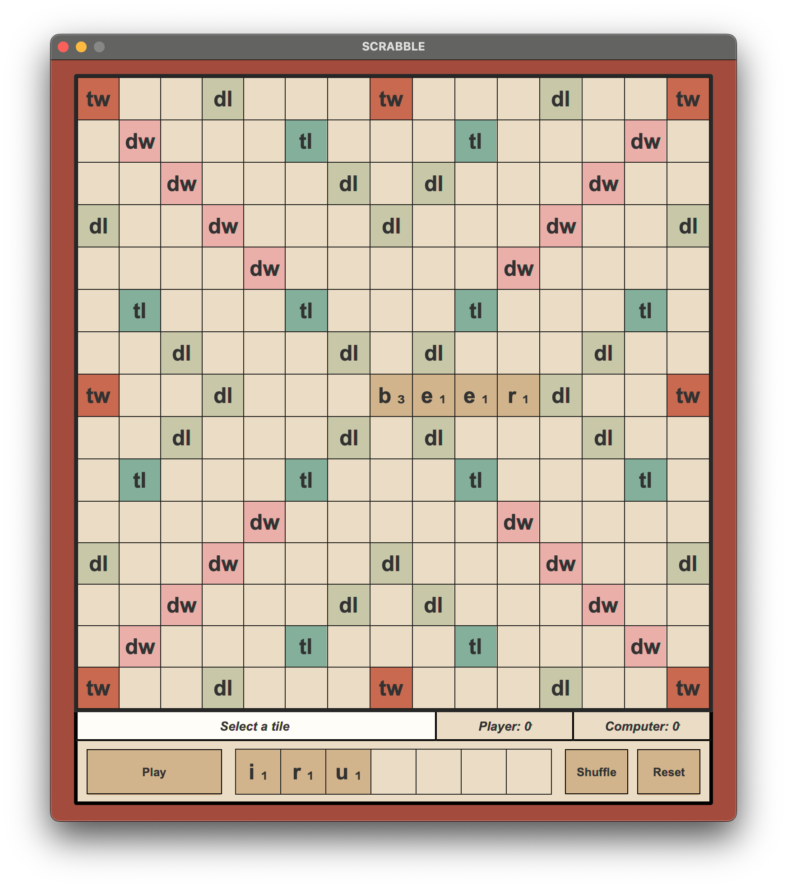
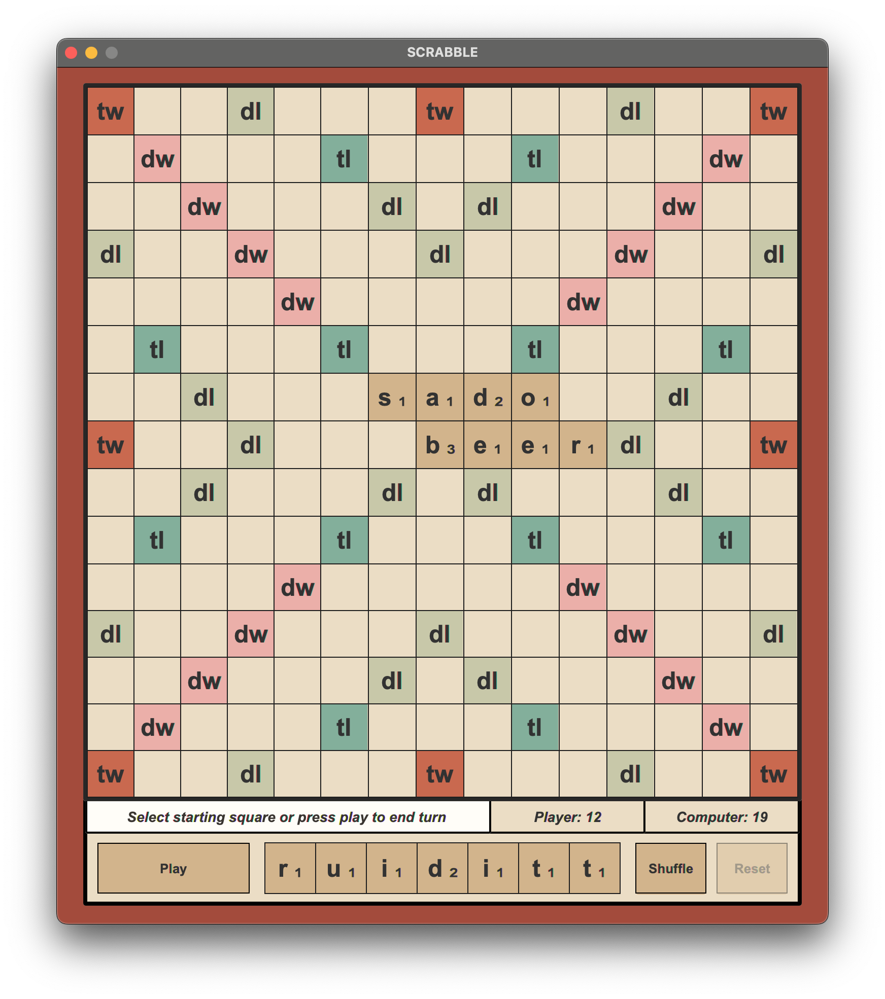
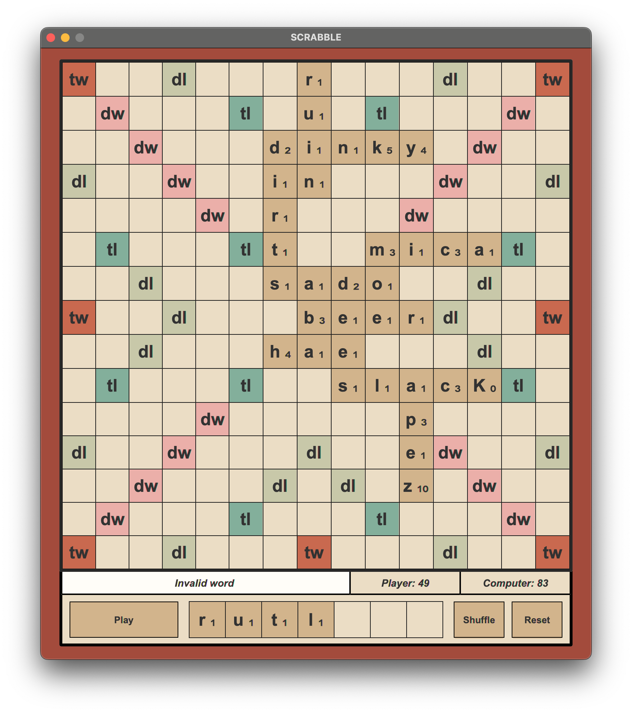
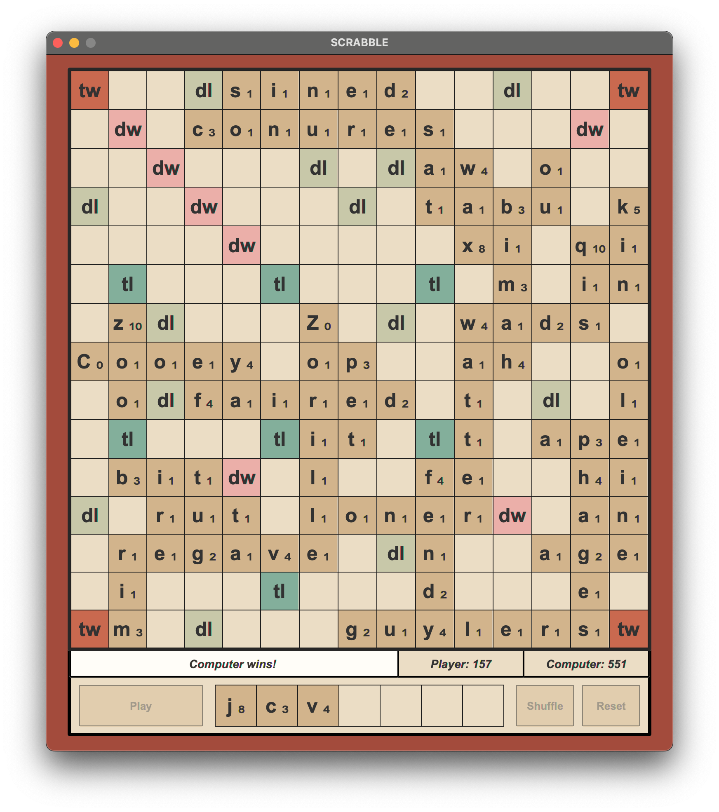

---
title: Scrabble
layout: template
filename: Scrabble.md
--- 

# Scrabble
By Andrew Valdez 

## How to Run
Solver     
`java -jar solver.jar dictionary.txt < input.txt > output.txt`

Scrabble   
`java -jar scrabble.jar`

## How to Play

The player starts the game by either selecting a starting square or selecting `Play` to end their turn.

The player may also selet `Shuffle` at any time to randomly rearrange the order of their unplayed tiles.

Once a tile is selected, the player must select a direction in which to build the word.

Once a direction is selected, the player may select tiles to add to the board or reset their turn.

If at least one tile has been placed, the player may select "Play" to submit the word. 

If a word is valid, it is played and the computer then plays a word.

Invalid words will not be played and the player can either continue adding to the word or reset their turn.

Each word is scored and each word score is added to the total score.
The participant with the highest score is declared the winner at the end of the game.

The game ends when the both solver and player have no valid plays. (Note: player must end their turn)

## Classes

### Trie Data Structure
Reads in dictionary and builds trie data structure
### Display
Handles all GUI elements and feeds player input into Player. Alternates turns between players.
### Board
Holds square objects with multiplier information, stores tiles placed on board.
### Tiles
Holds tile data such as letter, points, and blank status.
### Square
Holds board space data such as multipliers, anchor status, and tile.
### Player:
Ability to play word, check word validity, return tiles to rack if invalid. 
Keeps track of overall score and current word score.
### Solver
Plays word with the highest possible score using recursive backtracking.
### Main
Initializes Display and starts game.
### MainSolver
Reads in dictionary and input file, calls Solver to find best word, and produces output file.
