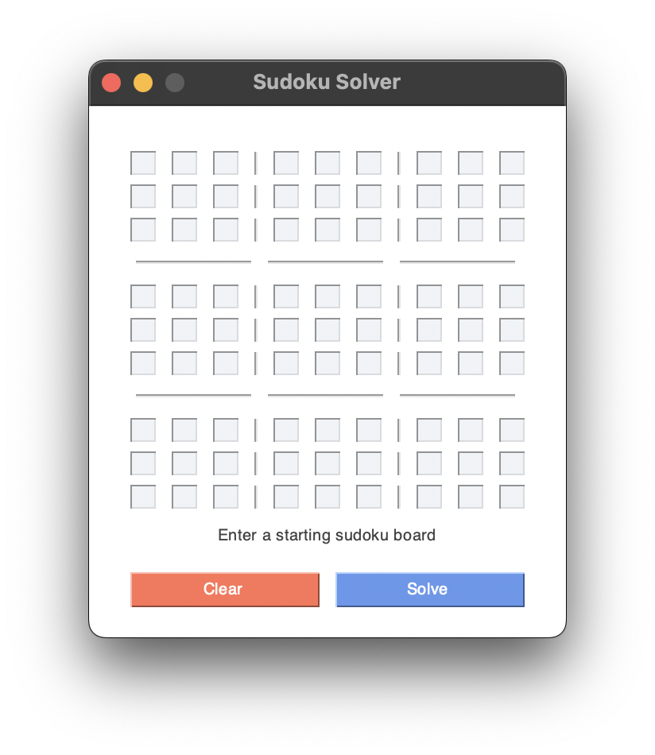
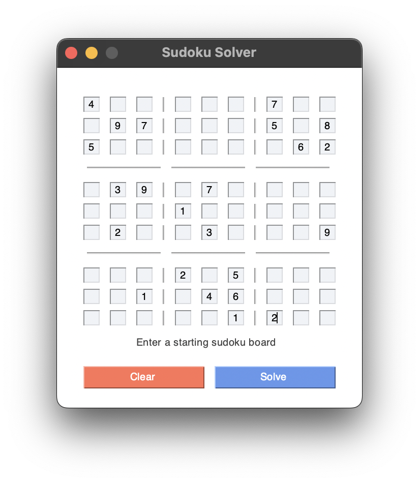
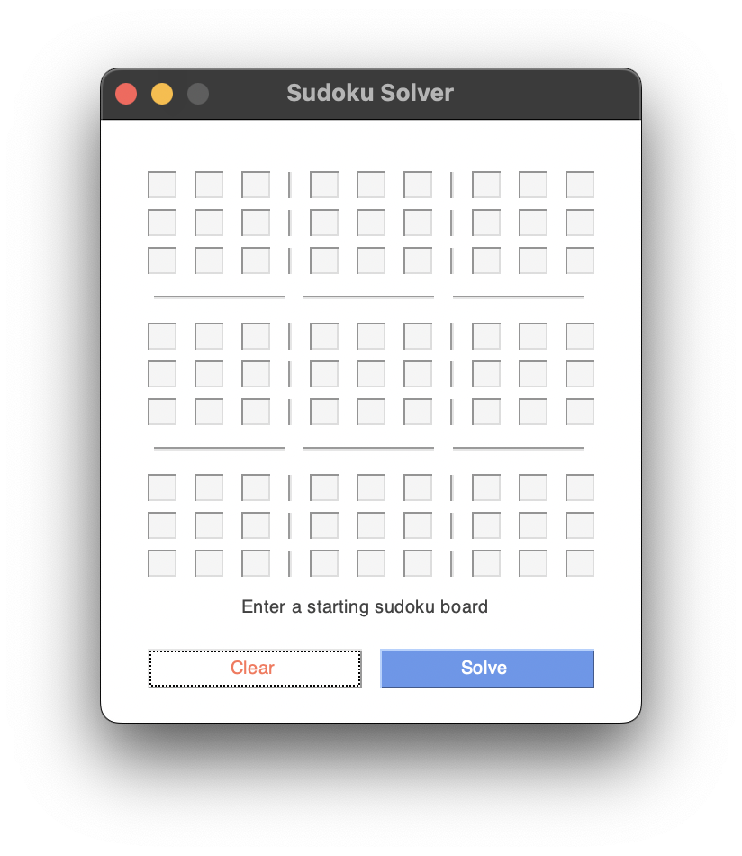
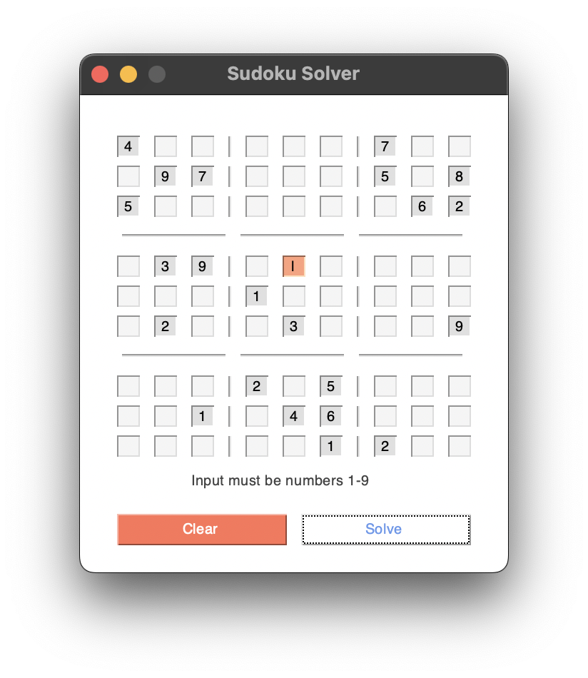
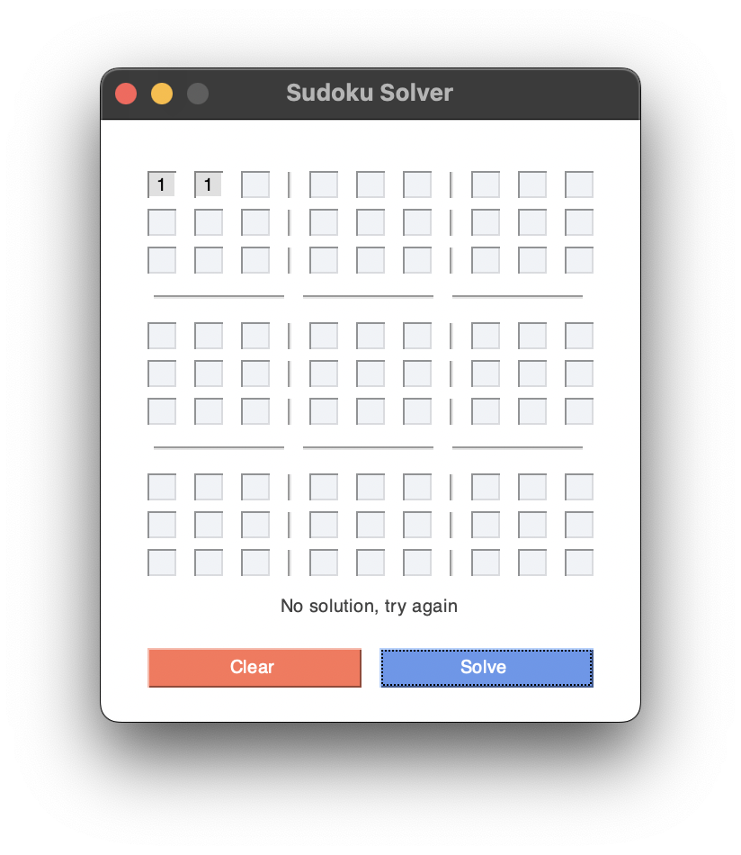
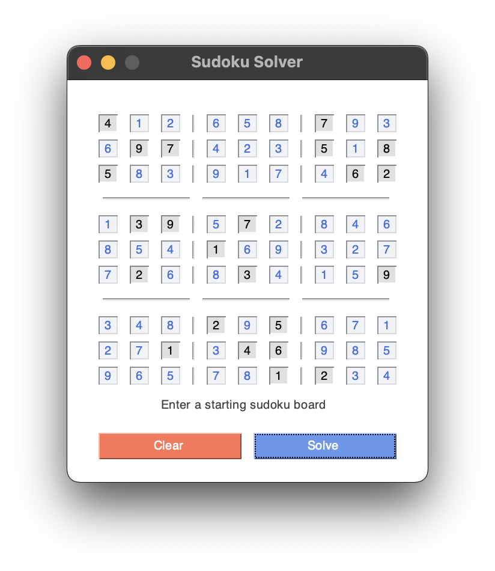

---
title: Sudoku Solver
description: By Andrew Valdez
name: Andrew Valdez
layout: default
filename: sudoku.md
--- 
## Description
A recursive backtracking algorithm to solve a given starting sudoku board. Invalid input and unsolvable boards are flagged as such, highlighting the grid cells of issue.

## How to use
Run `main.py` which will launch the following GUI:

Enter a starting sudoku board.

Clicking on the `Clear` button will clear all user input. 

Clicking on `Solve` will result in the following possibilities:

1. If the input is not valid, any invalid inputs will be indicated in red.

2. If the input is not solvable, the user will be made aware with a message.

3. If the input is valid and solvable, the solution will be determined and output.

Clicking the `Clear` button will clear the input and allow a new starting sudoku board to be entered.

<a href="https://github.com/avz-dev/sudoku-solver">GitHub Repository.</a>
